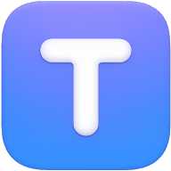
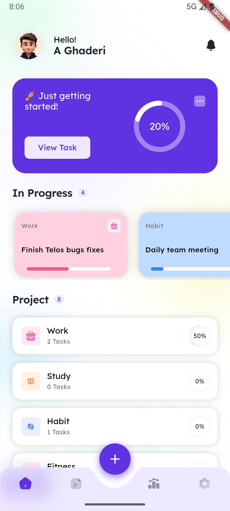
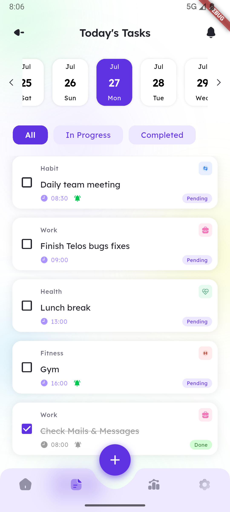
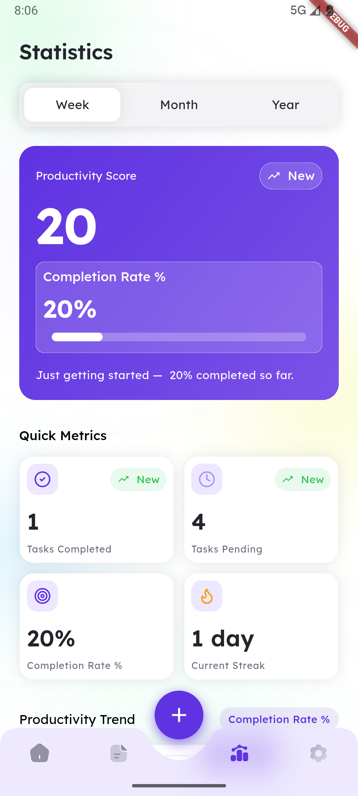
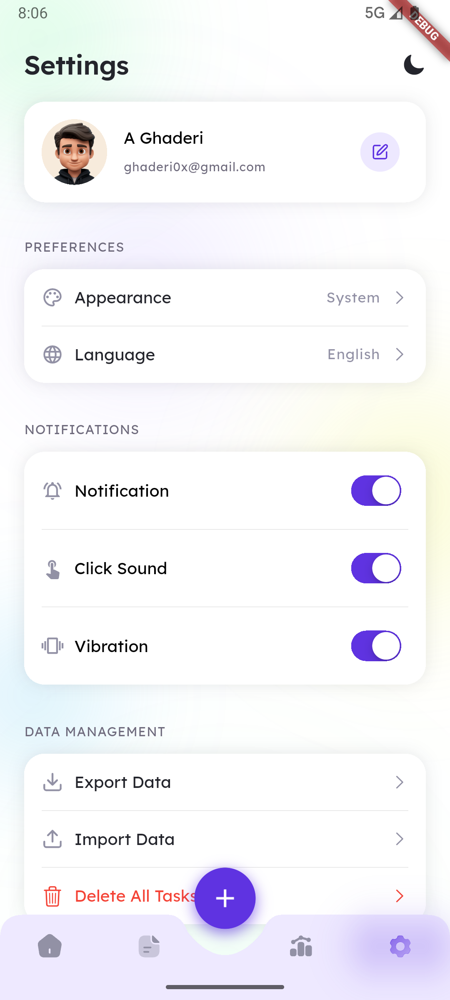
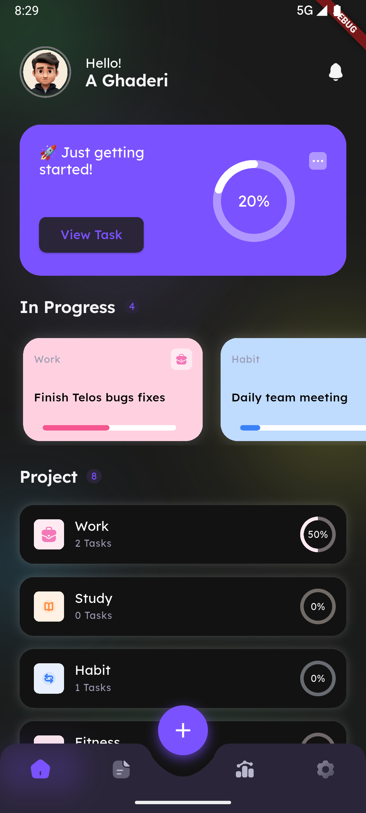

<div align="center">



# Telos

### A Modern Offline-First Task Management Experience

<p>
Organize tasks, build habits, track productivity, and stay focused — all while keeping your data local and private.
</p>

<p>


</p>

<p>
<a href="https://uniqueone.vercel.app/apps/telos">Website</a>
•
<a href="https://myket.ir/app/com.uniqueone.telos">Myket</a>
•
<a href="https://cafebazaar.ir/app/com.uniqueone.telos">Cafe Bazaar</a>
</p>

</div>

---

## ✨ Overview

**Telos** is a modern offline-first productivity application designed to help users organize tasks, build habits, manage projects, and monitor progress through insightful statistics and reminders.

Built from scratch as a personal Flutter project, including:

- UI/UX Design
- Application Architecture
- Database Design
- State Management
- Notifications System
- Localization
- Backup & Restore
- Release Management

The project focuses on delivering a clean user experience while maintaining performance, reliability, and complete offline functionality.

---

## 📱 Application Preview

### Home Dashboard



Track active projects, monitor progress, and access your most important tasks from a clean and focused dashboard.

---

### Daily Tasks



Manage daily activities with categories, reminders, due times, and completion tracking.

---

### Productivity Statistics



Visualize productivity trends, completion rates, streaks, and performance metrics.

---

### Settings & Preferences



Personalize the experience with themes, language preferences, notifications, backups, and more.

---

### Dark Mode



Fully supported dark experience with automatic system theme detection.

---

## 🚀 Features

### ✅ Task Management

- Create, edit, and organize tasks
- Project & category grouping
- Completion tracking
- Due dates and scheduling
- Habit management
- Progress indicators

### 🔔 Smart Reminders

- Scheduled notifications
- Background reminders
- Repeat notifications
- Works even when the application is closed

### 📊 Productivity Analytics

- Productivity score
- Completion rate
- Weekly statistics
- Monthly statistics
- Yearly statistics
- Progress visualization

### 🎨 Personalization

- Light Mode
- Dark Mode
- System Theme Detection
- English Language
- Persian Language

### 💾 Data Management

- Export Data
- Import Backups
- Local Backup Files
- Lightweight Data Protection
- Offline Data Access

### ⚡ Offline First

All core features work completely offline.

No account required.
No cloud dependency.
Your data stays on your device.

---

## 🏗 Architecture

Telos follows a Clean Architecture approach designed to keep the application maintainable and scalable.

```text
Presentation Layer
        │
        ▼
Business Logic Layer (Bloc)
        │
        ▼
Data Layer
        │
        ▼
Local Storage
(SQLite + Hive)
```

### State Management

- Bloc Pattern
- Separation of Concerns
- Predictable State Flow
- Scalable Feature Structure

---

## 🛠 Technology Stack

| Category | Technology |
|-----------|------------|
| Framework | Flutter |
| Language | Dart |
| State Management | Bloc |
| Database | SQLite |
| Local Storage | Hive |
| Notifications | flutter_local_notifications |
| Charts | fl_chart |
| Localization | flutter_localizations |
| File Management | file_picker |
| Audio Feedback | audioplayers |
| Networking | Dio |
| UI Components | Flutter SVG |
| Timezone Support | timezone |

---

## 💾 Storage Strategy

Telos uses a hybrid storage approach.

| Storage | Usage |
|----------|--------|
| SQLite | Tasks, projects, productivity records |
| Hive | Theme preferences, language selection, application settings |

This approach combines the reliability of structured relational data with the speed of lightweight local preferences.

---

## 🌍 Localization

Currently available in:

- 🇺🇸 English
- 🇮🇷 Persian (فارسی)

The application is designed with multilingual support from the ground up.

---

## 🔔 Notification System

The reminder system is designed to keep users on track throughout the day.

Features include:

- Scheduled notifications
- Background execution
- Timezone-aware scheduling
- Recurring reminders
- Reliable local delivery

---

## 📥 Download

### Official Website

https://uniqueone.vercel.app/apps/telos

### Myket

https://myket.ir/app/com.uniqueone.telos

### Cafe Bazaar

https://cafebazaar.ir/app/com.uniqueone.telos

---

## 🎯 Why I Built Telos

I created Telos to explore how a modern productivity application could be designed and engineered from the ground up using Flutter.

The project provided hands-on experience in:

- Mobile UI/UX Design
- Application Architecture
- State Management
- Local Databases
- Background Services
- Notifications
- Localization
- Backup Systems
- App Publishing & Distribution

The goal was not simply to build a task manager, but to create a polished and production-ready mobile experience.

---

## 🔮 Vision

Telos is designed with future expansion in mind.

Potential future directions include:

- iOS Support
- Cloud Synchronization
- Home Screen Widgets
- AI-Powered Productivity Features
- Calendar Integration

---

## 👨‍💻 Developer

**AmirMohammad Ghaderi**

GitHub: https://github.com/ghaderi0x

Email: ghaderi.dev404@gmail.com

---

<div align="center">

### Built with Flutter ❤️

**Telos — Plan. Track. Achieve.**

</div>
